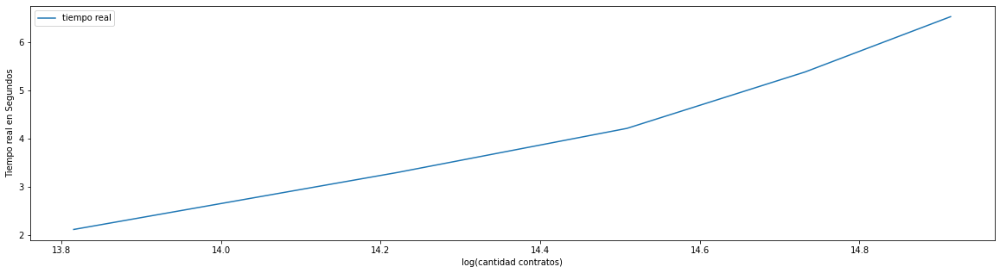

# Teoría de Algoritmos
## Trabajo Práctico 1 

| Padrón | Alumno                    |
|--------|---------------------------|
| 104105 | Jonathan David Rosenblatt |
| 103924 | Joaquín Fontela           |
| 104330 | Agustín Ghersi            |
| 104429 | Thiago Kovnat             |

# Tabla de Contenidos

- [Ejercicio 1](#ejercicio-1)
  - [Parte 1](#parte-1)
  - [Parte 3](#parte-3)
    - [Complejidad Temporal](#complejidad-temporal)
    - [Complejidad Espacial](#complejidad-espacial)
  - [Parte 4](#parte-4)
- [Ejercicio 2](#ejercicio-2)
  - [Datos](#datos)
  - [Recubrimiento](#recubrimiento)
  - [Algoritmo Con División y Conquista](#algoritmo-con-división-y-conquista)
  - [Relación de Recurrencia](#relación-de-recurrencia)
  - [Complejidad Algorítmica](#complejidad-algorítmica)
    - [Análisis Temporal](#análisis-temporal)
    - [Análisis Espacial](#análisis-espacial)

# Ejercicio 1

## Parte 1

Primero vamos a demostrar lo pedido con un contraejemplo. La solución propuesta por la administración no es óptima, pues siguiendo el algorítmo introducido podriamos llegar a la siguiente situación:

Si tenemos la siguiente distribución de contratos:

- Contrato A: Lunes 9am hasta la 1pm (duración 4 hs)
- Contrato B: Lunes 2pm hasta las 6pm (duración 4 hs)
- Contrato C: Lunes 7am hasta las 12am (duración 5 hs)
- Contrato D: Lunes 12am hasta las 5pm (duración 6 hs)
- Contrato E: Lunes 5pm hasta las 10pm (duración 5 hs)

El algorítmo tomaría primero el contrato A pues es el que comienza antes que dura menos. Por lo tanto luego podrá elegir entre B y E para continuar (el resto no, pues se superponen y son incompatibles). Terminará eligiendo el contrato B pues dura menos que el contrato E y luego terminará la ejecución del algoritmo pues no tendrá más tareas compatibles para aceptar.

Esta aplicación del algoritmo resulta no devolver la solución óptima, pues elegir los contratos C, D y E brindaría un total de contratos (y horas) mayor al que brinda A y B.

```
+---------------------------------------------------------------+
             |     Lunes     |    |     Lunes     |            
             |   9am hasta   |    |   2pm hasta   |  
             |    la  1pm    |    |    las 6pm    |
+---------------------------------------------------------------+
        |    Lunes     |     Lunes     |      Lunes      |
        |  7am  hasta  |  12am  hasta  |   5pm  hasta    |  
        |   las 12am   |    las 5pm    |    las 10pm     |
+---------------------------------------------------------------+
```

Por lo tanto, como existe una solución mejor, podemos afirmar que el algorítmo no devuelve siempre la solución óptima. 
<div align="right">□</div>

## Parte 3

### Complejidad Temporal

Para analizar la complejidad temporal podemos ver lo que ocurre en el pseudocódigo del algoritmo:

- Primero ordenamos el conjunto de pedidos. Esto, con un buen algorítmo de ordenado, será `O(n*log(n))`
- Luego entramos en un ciclo donde loopeamos por cada elemento del conjunto de pedidos de tamaño `n`, (y todas las operaciones interna al mismo son `O(1)`) lo cual hace que el mismo sea `O(n)`
- Por lo tanto la complejidad temporal total del algoritmo será `O(n*log(n)) + O(n)` lo cual se reduce a `O(n*log(n))` por propiedades de la cota [_Big O_](https://en.wikipedia.org/wiki/Big_O_notation).
- Podemos visualizar los datos en el siguiente gráfico:


### Complejidad Espacial

Analizar la complejidad espacial del algoritmo no resulta muy complicado, pues el set de soluciones, en el peor caso, tendrá tantos elemenos como pedidos ingresados. Esto podría ocurrir si, por ejemplo, todos los pedidos son consecutivos unos a otros y estos son todos compatibles entre si. Por lo tanto, la complejidad espacial es de `O(n)`.

## Parte 4

Aquí demostraremos que la solución programada por nosotros es óptima.

Para esto diremos que nuestro conjunto de pedidos es `P` tal que `|P| = n`, y al ejecutar nuestro algoritmo el resultado del mismo nos devuelve `A = {A[1], ..., A[k]}` tal que `|A| = k`. También diremos que la solución óptima al problema se denominará `O = {O[1], ..., O[m]}` tal que `|O| = m`.

Nosotros queremos demostrar que `A = O`, que es equivalente a `|A| = |O|` (ya que nuestro objetivo es maximizar la cantidad de pedidos compatibles que podemos agrupar). 

También tendremos una función `F`, la cual recibe un pedido y devuelve el horario en el que este finaliza y la función `S` que hace lo mismo que su contraparte pero para el horario de inicio del pedido.

En particular pedimos que el tiempo de finalización de cada tarea que elige nuestro algoritmo sea mejor o igual al que da la solución óptima ⇒ Pedir que `|A| = |O|` es equivalente a pedir `F(A[w]) <= F(O[w])` para todo `w in [1,k]`. 

El resto de la demostración se realizará con inducción. Primero empezamos con `r = 1`. Acá sabemos que `A[1]` (es decir, la primera tarea de nuestro resultado) terminá antes o a la vez que `O[1]` por la naturaleza de nuestro algoritmo ⇒ `F(A[1]) <= F(O[1])`.

Ahora asumimos que con `r-1 in [2,k]` la condición se cumple, es decir, `F(A[r-1]) <= F(O[r-1])` (hipótesis inductiva).

Si `F(A[r-1]) <= F(O[r-1])` y `F(O[r-1]) <= S(O[r])` ⇒ `F(A[r-1]) <= S(O[r])`.

Esta última inecuación significa que cuando nuestro algorítmo elige el pedido `A[r]` también estaba disponible para elegir al `O[r]`. Eso implica que, como el algorítmo seleccionó a `A[r]`, este "le convenía", es decir, finalizaba antes que `O[r]` ⇒ `F(A[r]) <= F(O[r])`. 

Podemos hacer el cambio de variables `r = w` ⇒ `F(A[w]) <= F(O[w])` para todo `w in [1,k]` ⇒ `|A| = |O|` ⇒ `A = O` ⇒ Nuestra solución es óptima. 
<div align="right">□</div>

# Ejercicio 2

## Datos

Conocemos que tenemos una superficie de `n*n` metros cuadrados, donde podemos cubrir con baldosas la superficie del mismo. `n` es potencia de 2. Estas balosas tienen forma de 'L' y están compuestas por 3 bloques de un metro cuadrado. Debemos plantear un algorítmo óptimo que pueda llenar la superficie, dado que que en una posición `x,y` se encuentra un bloque de un metro cuadrado que no debe ser tapado. Es conveniente pensar a la superficie a cubrir como una matriz de baldosas.

## Recubrimiento

Antes de presentar el algorítmo que busque una solución, debemos demostrar que esta puede existir. Esto se logrará demostrando que los metros cuadrados de la superficie dada permiten posicionar baldosas sin dejar espacios libres y sin hacer cortes entre baldosas.

La demostración seguirá los siguientes pasos:

- Primero sabemos que como la superficie tiene `n*n` metros cuadrados, necesitaremos `n*n` baldosas de un metro cuadrado ⇒ Necesitamos que `n*n mod 3 ≡ 0` (ya que si esto cumple, cualquier superficie dada podrá ser recubierta de baldosas en 'L'). Utilizamos el operador `%` para reemplazar al módulo.

- Como `n` es una potencia de 2 ⇒ `n = 2^k` siendo `k` un número natural ⇒ tendremos que recubrir la superficie con `(n*n) - 1 = (2^k * 2^k) - 1 = 2^2k - 1` baldosas (el -1 aparece por la posición que no tenemos en cuenta por el sumidero). 

- Por lo tanto tenemos que demostrar que `2^2k - 1 % 3 = 0`. Lo podemos hacer por _inducción_:
  - _Con `k = 0`_ tenemos que `2^(2*0) - 1 % 3 = 1 - 1 % 3 = 0 % 3 = 0` se cumple la propiedad.
  - _Con `k = r`_ asumimos que la propiedad se cumple (hipótesis inductiva) ⇒ `2^2r - 1 % 3 = 0`
  - _Con `k = r+1`_ podemos ver que `2^(2*(r+1)) - 1 % 3 = 2^2r * 2^2 - 1 % 3 = 4*2^2r - 1 % 3 = (4*2^2r - 4 + 3) % 3 = (4(2^2r - 1) + 3) % 3 = (4(2^2r - 1) % 3 + 3 % 3) % 3` y como para `k = r` la propiedad se cumple, `(4 * 0 + 3 % 3) % 3 = (0 + 3 % 3) % 3 = 0 % 3 = 0`.

- Entonces, como se cumple la propiedad para `k = r` y `k = r+1` ⇒ La propiedad se cumple para todo `k`.

- Como `(2^2k - 1) % 3 = 0`, podemos cubrir toda nuestra superficie de `n*n` metros cuadrados con baldosas de 'L' sin realizar cortes ⇒ Existe la solución al algorítmo. 
<div align="right">□</div>

## Algoritmo con División y Conquista

Antes de plantear el pseudocódigo, debemos explicar como funciona el algoritmo:

```
function TileSolver(n, p, x, y):
  
  if (n == 2):
    Completar el pequeño cuadrado con la baldosa en 'L' que falta en p.
    # Siempre tendremos una baldosa ocupada, ya sea por una de 'L' que pusimos de la recursión 
    # Anterior o por el sumidero.
    return     

  Ubicar una baldosa en 'L' en el centro de la superficie dada, es decir, en el middle(p). 
  Hacerlo de tal forma que el cuadrante que posee el sumidero no se lleve un tercio de nuestra
  baldosa en 'L'.
  # Lo hacemos así para que cada cuadrante tenga una baldosa menos. Condición ya demostrada de ser
  # necesaria para obtener una solución válida en cada cuadrante (y subcuadrante) del problema.

  TileSolver(n/2, p.superiorIzquierdo, x, y)
  TileSolver(n/2, p.superiorDerecho, x, y)
  TileSolver(n/2, p.inferiorIzquierdo, x, y)
  TileSolver(n/2, p.inferiorDerecho, x, y)

  return
```

## Relación de Recurrencia 

Como utilizamos un algoritmo de División y Conquista podemos plantear la siguiente relación de recurrencia para analizar el tiempo que tarda el algoritmo:

```
T(n) = a*T(n/b) + f(n)
```

Siendo a,b constantes que representan las llamadas recursivas y las partes en que se dividen el algorítmo respectivamente. Para nuestro problema `a = 4` por las 4 llamadas recursivas y `b = 2` pues son las partes en que dividimos el problema. 

Hasta ahora tenemos: 

```
T(n) = 4*T(n/2) + f(n)
```

Pero no conocemos a `f(n)` que representa el costo del resto de operaciones del algoritmo. Sabemos que no realizamos ningún tipo de "operación pesada", es decir, verificar un caso base y ubicar una baldosa en el medio son operaciones `O(1)`. Esto implica que la relación de recurrencia resulta ser:

```
T(n) = 4*T(n/2) + O(1)
```

## Complejidad Algorítmica

### Análisis Temporal

Para el análisis temporal utilizaremos el [teorema maestro](https://en.wikipedia.org/wiki/Master_theorem_(analysis_of_algorithms)). 

- Primero vemos que como `f(n) = O(1)`, podremos encontrar la forma de `T(n)` por el teorema maestro, si logramos afirmar que nuestra cota superior tenga la siguiente forma `O(1) = O(n^(log a/log b - e)), e > 0`.

- Luego recordamos que `a = 4 & b = 2` ⇒ `O(1) = O(n^(log 4 / log 2 - e)) = O(n^(2-e))` ⇒ `1 = 2 - e` ⇒ `e = 1` ⇒ Se cumple la condición que pediamos antes; esta cota permite entonces llegar a un resultado.

- Por el teorema maestro `f(n) = O(n^(log a/log b - e)), e > 0` ⇒ `T(n) = Θ(n^(log a/log b))` ⇒ Reemplazando, `T(n) = Θ(n^(log 4 / log 2))` ⇒ `T(n) = Θ(n^2)`. 

Por lo tanto podemos acotar superior e inferiormente el tiempo del algorítmo con `T(n) = Θ(n^2)`. 
<div align="right">□</div>

### Análisis Espacial

Nuestro programa generará una matriz de exactamente `n^2` valores. A lo largo del algoritmo, las únicas asignaciones que hacemos a memoria ocurren cuando plantamos una baldosa en 'L' en la matriz. Por lo tanto, sabemos que el uso de memoria, en función de `n` estará doblemente acotado.

Si definimos a `E(n)` como la función que evalua el tamaño que ocupa el algorítmo en función de `n` ⇒ `E(n) = Θ(n^2)`. 
<div align="right">□</div>