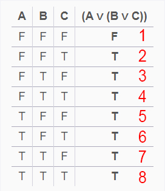
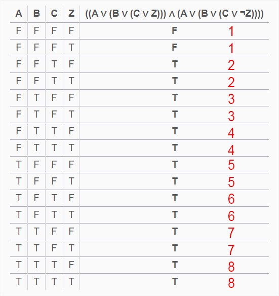

# Teoría de Algoritmos
## Trabajo Práctico 2 

| Padrón | Alumno                    |
|--------|---------------------------|
| 104105 | Jonathan David Rosenblatt |
| 103924 | Joaquín Fontela           |
| 104330 | Agustín Ghersi            |
| 104429 | Thiago Kovnat             |

# Tabla de Contenidos

- [Ejercicio 1](#ejercicio-1)
    - [Mudanza es NP](#mudanza-es-np)
    - [Bin-Packing](#bin-packing)
        - [Bin-Packing es NP](#bin-packing-es-np)
        - [Bin-Packing es NP-Hard](#bin-packing-es-np-hard)
    - [Mudanza es NP-Completo](#mudanza-es-np-completo)
- [Ejercicio 2](#ejercicio-2)
    - [Barcos es NP](#barcos-es-np)
    - [4 Pack](#4-pack)
        - [3SAT a 4SAT](#3sat-a-4sat)
        - [4SAT a Barcos](#4sat-a-barcos)
    - [2 Pack](#2-pack)
- [Ejercicio 3](#ejercicio-3)
    - [Reducción Polinomial](#reducción-polinomial)
    - [Problemas P y NP](#problemas-p-y-np)
    - [Caja Negra](#caja-negra)

# Ejercicio 1

Vamos a demostrar que el problema es NP-Completo demostrando que Bin-Packing se puede reducir polinomialmente a nuestro problema. Con esto obtendremos que el problema a analizar es NP-Hard y solo faltaría demostrar que el mismo es NP.

## Mudanza es NP

Tenemos que mover, dentro de recipientes de volumen `V` una cantidad `n` elementos y podemos usar como máximo `r` recipientes tal que hagamos hasta `k` viajes. Debemos decidir si este problema es NP-Completo.

Primero tenemos que verificar que el problema es NP. Esto se realiza facilmente ya que la verificación consiste en:
- Tomar los elementos asignados a cada bin y verificar que sus correspondientes sumas no superen `V` (`O(n)`).
- No tener más de `r*k` de estos (`O(n)`).
- Ver que en cada viaje no se lleven más de `r` contenedores (`O(n)`). 

Como la verificación es polinomial llegamos a que el problema es NP.

## Bin-Packing

El problema de Bin-Packing consiste de tener una serie de items los cuales deben ser divididos en `m` cajas de volumen `V` y queremos ver si se puede asignar los elementos para que entren en las cajas. 

Con esto en mente podemos reducir Bin-Packing a nuestro problema, teniendo `m := r*k` cajas y un solo viaje.

Por lo tanto falta demostrar que Bin-Packing es NP-Completo.

### Bin-Packing es NP

Sea el set `X = {X[0], X[1], ..., X[n]}` de elementos. Debemos realizar algo muy parecido al caso anterior; pensemos que en la verificación recibimos `Y = {{Y_0[0], Y_0[1], ..., Y_0[z]}, ..., {Y_m[0], Y_m[1], ..., Y_m[z']}}` siendo que el i-ésimo elemento de Y es un set de los elementos de X que está asignado al i-ésimo bin. Por lo tanto la verificación consiste en verificar que la sumatoria de los elementos de cada subset no supere la capacidad máxima y que la cantidad total de subsets no supere la cantidad máxima de bins totales. Esto se hace en tiempo polinomial y por lo tanto es NP.

### Bin-Packing es NP-Hard

Vamos a demostrar que Bin-Packing es NP-Hard reduciendo al Partition Problem como una instancia de Bin-Packing. El problema de 2-partition se pregunta si puedo separar un set de números en un set dos elementos que sumen lo mismo y podemos reducir el problema a Bin-Packing con dos bins de `(b[0] + ... + b[n])/2` de volumen, siendo `{b[0], ..., b[n]}` el set de valores del problema de 2-partition (ajustamos a ese volumen pues es el la mitad de elementos que asignaremos a cada bin). Por lo tanto `2-PARTITION <p BIN-PACKING` y 2-Partition es un problema NP-Hard ⇒ Bin-Packing es igual o más complicado que 2-Partition ⇒ Bin-Packing es NP-Hard.

Por lo tanto, como Bin-Packing es un problema que pertenece a NP y NP-Hard, es NP-Completo.

## Mudanza es NP-Completo

Como `BIN-PACKING <p MUDANZA` y el problema de la mudanza es NP-Hard ⇒ Entonces es NP-Completo (Pues `NP-C = NP ∩ NP-Hard`).

# Ejercicio 2

Tenemos `n` packs que los clientes pueden comprar para sus barcos y `m` restricciones que deben cumplir, tal que cada pack puede activar o desactivar la validez de cierta restricción. Demostraremos en las siguientes partes como diferentes variaciones del problema son NP-Completos.

## Barcos es NP

La demostración de que este problema es NP es bastante trivial. Si tengo el set de packs que un cliente quiere comprar, verificar que todas las restricciones se cumplan se puede hacer en forma lineal iterando por todos packs verificando que no falte ninguna restricción por cumplir. Por lo tanto el problema de los barcos resulta ser NP.

## 4 Pack 

Para este problema realizaremos el análisis tal que cada restricción a cumplir está atado a 4 packs, donde cada uno puede activarlo o desactivarlo. Para resolver el problema vamos a saltar de 3SAT a 4SAT y finalmente a nuestro problema demostrando que `3SAT <p BARCOS`.

### 3SAT a 4SAT

Primero supongamos que tenemos la siguiente instancia de 3SAT (siendo que en este trabajo los caracteres `||` representan un `OR` lógico e `&&` representa el `AND` lógico):

``` 
3SAT(X1, X2, ..., Xn) = (Xa || Xb || Xc) && ... && (Xw || Xy || Xz) 
``` 

Donde tengo una gran expresión booleana en su forma conjuntiva, tal que cada `Xi` pertenece a `{X1, X2, ..., Xn, ¬X1, ¬X2, ..., ¬Xn}`.

Podemos analizar la siguiente expresión:

```
(A || B || C) = (A || B || C || Z) && (A || B || C || ¬Z)
``` 

Viendo como cada resultado de la expresión izquierda (dentro de su tabla de verdad):

<br><div align="center"></div><br>

Mappea perfectamente a la expresión derecha (números rojos) independientemente del estado de veracidad de Z: 

<br><div align="center"></div><br>

Llegamos a que podemos expresar nuestra función original como: 

``` 
(Xa || Xb || Xc) && ... && (Xw || Xy || Xz) = (Xa || Xb || Xc || Z) && (Xa || Xb || Xc || ¬Z) && ... && (Xw || Xy || Xz || T) && (Xw || Xy || Xz || ¬T) 
``` 

Por lo que nuestra función general de 3SAT es una instancia del problema de 4SAT donde la cuarta variable booleana de nuestra ecuación en forma conjuntiva tiene la restricción de siempre aparecer simétricamente sumando en un término (or) y sumando el negado en el otro (or not). Y habiendo demostrado que las expresiones booleanas matchean por tablas de verdad, cualquier solución de mi sistema de 3SAT puede resolver esta instancia particular de 4SAT y por lo tanto: `3SAT <p 4SAT` pues 4SAT es tan o más difícil que 3SAT.

En consecuencia 4SAT pertenece a NP-Hard y obviamente pertenece a NP (pues la verificación de la solución consiste en reemplazar los valores en la función y ver que evalue en TRUE, algo que se resuelve en tiempo polinómico) por lo que es NP-Completo.

### 4SAT a Barcos

Ahora solo falta pasar de 4SAT al problema de los Barcos.

Para ello sabemos que 4SAT, que acabamos de demostrar que es NP-Completo, tiene la forma de: 

``` 
4SAT(X1, X2, ..., Xn) = (Xa || Xb || Xc || Xd) && ... && (Xv || Xw || Xy || Xz) 
``` 

Podemos expresar que cada clausula del problema de 4SAT representa una restricción en nuestro problema de barcos, y cada elemento dentro de las clausulas es el pack asociado a dicha restriccion. El elemento negado representaría que la no inclusión del pack hace que la restricción se cumpla. Por lo tanto, se podría expresar de la siguiente forma:

``` 
4SAT(X1, X2, ..., Xn) = (Xa || Xb || Xc || Xd) && ... && (Xv || Xw || Xy || Xz) 
                      =      Restricción 1     && ... &&     Restricción M
``` 
Aclaramos que las operaciones or en cada paréntesis son necesarias para cumplir con el pedido de la consigna que dice que una restricción puede ser cumplida por cualquier pack que la satisfaga. 

La reducción a nuestro problema de barcos se puede hacer de forma polinómica y encontrar una solución para el problema de barcos nos daría una solución para 4SAT.

Por lo tanto, `4SAT <p Barcos`, y como 4SAT es NP-Completo y Barcos es NP, podemos decir que nuestro problema de barcos es NP-Completo.


## 2 Pack

Para este problema vamos a partir del problema 2SAT. Como vimos en el punto anterior, podemos pasar de un problema del estilo 2SAT a nuestro problema de 2-Pack ya que podemos tomar las clausulas como las restricciones y los elementos dentro de las clausulas como los packs asociados a la restricción. Ahora debemos demostrar que 2SAT es un problema que pertenece a P.

Para demostrar que existe una solución polinomial, vamos a expresar el problema de 2SAT como un grafo. Supongamos que en nuestro problema de 2SAT tenemos `n` variables y `m` clausulas. Sea ahora el Grafo `G = (V, E)` con `2n` vertices. Estamos creando 2 vertices por cada variable `X`, una que sea `¬X` y otro que sea `X`. Por cada clausula `(X || Y)`, donde `X` e `Y` son variables dentro de nuestro problema 2SAT, creamos una arista dirigida que vaya de `¬X` a `Y`, y otra arista que vaya de `¬Y` a `X`. Esto se hace ya que para que exista solución, todas las clausulas deben evaluar a TRUE, por lo que si `X` es FALSE, `Y` debe ser TRUE, y si `Y` es FALSE, `X` debe ser TRUE.

Una vez que tenemos planteado el grafo, podemos decir que no existe a solución al problema de 2SAT si se cumplen las siguientes condiciones:

1. Existe un camino de `X` a `¬X` en el grafo.
2. Existe un camino de `¬X` a `X` en el grafo.

Esto se cumple debido a que el grafo expresa las condiciones necesarias para que exista solución, y si en el grafo existe un camino de `X` a `¬X` en el grafo (o viceversa) eso nos indicaría que tanto `X` como `¬X` deben ser TRUE, lo cual sabemos que es imposible, y por lo tanto no existe solución.

Demostremos que efectivamente esto ocurre.

Supongamos que existe un camino de `X` a `¬X` y un camino de `¬X` a `X` en el grafo.
Tomemos como ejemplo caminos del estilo:

```
X → Y → ¬X 
¬X → Z → X
```

y tomemos como punto de partida que `X` es TRUE. La arista entre `X` e `Y` existe si existe la clausula `(¬X || Y)`, y repetimos lo mismo para el resto de los ejes. Por lo tanto, llegamos a la siguiente expresión:

```
(¬X || Y) && (¬Y || ¬X) && (X || Z) && (¬Z || X)
```

Recordemos que `X` es TRUE, por lo que necesariamente en la primera clausula `Y` debe ser TRUE. En la segunda clausula, `¬Y` es FALSE por lo que `¬X` debe ser TRUE, lo cual es imposible.

Miremos el caso de que `X` sea FALSE:

En la primera clausula, `¬X` es TRUE, por lo que `Y` puede ser TRUE o FALSE. En la segunda clausula, `¬X` es TRUE por lo que se cumple la clausula. En la tercera clausula, `X` es FALSE, por lo que `Z` debe ser TRUE. En la ultima clausula, `¬Z` es FALSE, por lo que `X` debe ser TRUE, lo cual es imposible.

Por lo tanto, podemos observar que no existe solución ya que no hay manera de elegir un valor de `X` que resulte en que toda la expresión sea verdadera.

Para saber si una solución es posible, basta con ver si se cumple esto para algun elemento del problema, lo cual es posible de hacer en tiempo polinomial. Por lo que 2SAT pertenece a P, y como podemos reducir 2SAT a nuestro problema, nuestro problema tambien pertenece a P.

# Ejercicio 3

## Reducción Polinomial

La reducción polinomial consiste en transformar un problema en otro para resolver este nuevo problema y reutilizar la resolución del mismo para resolver a su vez el problema original. Se puede utilizar ademas para acotar y clasificar distintos tipos de problemas en función del tiempo de resolución.

## Problemas P y NP

Los problemas P son aquellos problemas que se pueden resolver en tiempo polinomial y NP son los problemas a los que se les puede verificar en tiempo polinomial la solución. 

Ahora sabemos que si un problema Q existe en P entonces se puede resolver en `O(n^k)` por lo que podemos certificar la solución del mismo con el siguiente pseudocódigo:

```
function verificacion(instancia, token)
    solucion = Algoritmo(instancia)
    return (solucion == token)
```

El cual valida en tiempo polinomial. Por lo tanto P está contenido en NP. Pero no está demostrado el inverso. Si esto fuera así, los dos conjuntos serían iguales.

## Caja Negra

3.1 Si el problema B lo resolvemos con NA, significa que hay una reducción polinomial de tal forma que `B <p A` y por lo tanto podemos decir que al menos tan difícil de resolver que el problema B.

3.2 En cambio si A se puede resolver con NB, entonces A es igual o menos complicado que B, por lo que pertenecería a P.

3.3 Si A es NP-C:

3.3.1 Si estoy reduciendo B en A significa que `B <p A`, por lo tanto B, ***en el peor caso***, es igual de complicado de resolver que A. Entonces en el peor caso, B sería NP-Hard.

3.3.2 Si estoy reduciendo A en B significa que `A <p B`, por lo tanto B, es al menos tan difícil de resolver que A y por lo tanto B pertenecería a NP-Hard. 